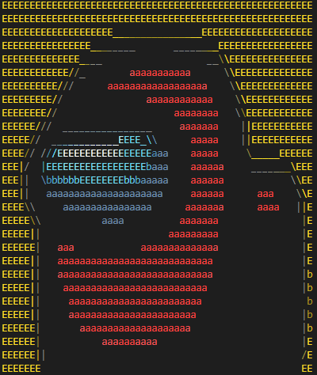
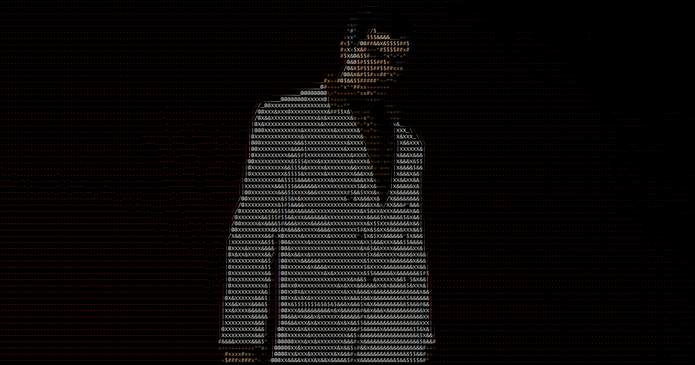

# C ascii maker

Simple command line that can take an input image and generator ascii-art from the image. Check [this folder](./examples/) for couple example outputs. Making terminal characters smaller will improve output quality significantly. 

Special thanks to [Xander Gouws](https://github.com/gouwsxander) and his youtube video for inspiring me to create this project. [Link To Video](https://www.youtube.com/watch?v=t8aSqlC_Duo)


Usage:
```bash
./ascii.exe path/to/image.png -other [value] --flags
```

To build: 
```bash
# Regular build
make

# build with clang (with optimzations on)
make clang

# compiled with optimizations
make release
```
Build Requirements:
- GCC or CLANG version that supports C99
- GNU Make 

### Optional flags
- `-mw` maximum width  (Default terminal width or 96 characters)  
- `-mh` maximum height (Default terminal height or 64 characters)  
- `-set` Sobel edge detect threshold (DEFAULT: 67.0) (yes I know this feels like a joke but it works better than I expected)
- `-cr` Character Ratio (Default 2.0)  
- `-ba` Brighten image amount (Default 1.0 -> Doesn't brighten) Note that any value over 2.0 may result in overly bright images  
- `--usebw` output with no color (Default OFF)  
- `-c` Use custom charcters for brightness in ascending order (Default: " .-=+*x#$&X@") Note that you can wrap "" around your input to include the whitespace character  

- `-o` Output to ASCII to file (DEFAULT OFF)
- `-r` Read outputted file (Slightly different usage -> `./cascii.exe -r file_to_read.txt`)

Note that if you use output on a colored image without setting the `--usebw` flag you may need to use a terminal viewer to view the image properly. The color is output using Ansi escape sequences. However, if you do use the flag `--usebw` you may view the outputted file with a regular text viewer.

```bash
# viewing outputted image 
./cascii.exe lightning.jpg -o lightning.txt

# use cat
cat lightning.txt

# use less to view
less -R lightning.txt

# or just use cascii to read it
./cascii.exe -r lightning

# example with --usebw flag
./cascii.exe lightning.jpg -o lightning-normal.txt --usebw

# use any normal text editor to view
nvim lightning-normal.txt

# or you can open with notepad
notepad++ lightning-normal.txt
```


Example use cases 
```bash
# use default paramters for everything
./cascii.exe lightning.jpg

# Dont brighten image and effectively turn off the sobel threshold
./cascii.exe lightning.jpg -ba 1 -set 255.0

# produce black and white output
./cascii.exe lightning.jpg --usebw

# Output to a file
./cascii.exe lightning.jpg -o lightning.txt

# Using custom characters for an image using whitespace, a, b and E
./cascii.exe images/imposter.jpg -c " abE" 
```

## How it works (In a nutshell..)

- First loads an image using [stb image](https://github.com/nothings/stb)
- Resizes image to match given parameters or the terminal height and width while accounting for the character ratio in terminals (typically 1 to 2)
- Does an Image convolution across the given image using a sobel Kernel to give sharper edges
- Uses luminosity for the sobel threshold and outputs | \ / _ depending on which direction the sobel is
- Use Ansi Escape codes to output color to the terminal

### Couple Examples (Featuring Kazuma Kiryu)



